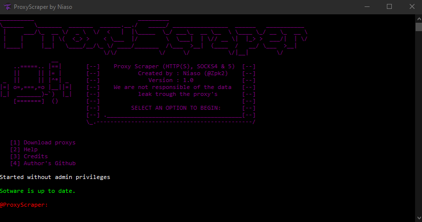

#  ProxyScraper
> Download proxy lists simply.

With this software you can download all type of proxy (http(s), socks4, socks5).



## Installation

OS X & Linux:

```sh
Support not planned at the moment
```

Windows:

```sh
Just execute ProxyScraper.exe
```

## Usage example

A few motivating and useful examples of how your product can be used. Spice this up with code blocks and potentially more screenshots.

_For more examples and usage, please refer to the [Wiki][wiki]._

## Development setup

C# Sources will be aviable soon

```sh
Open the project .sln file check and modify what you want and compile it
```

## Release History

* 1.0
    * Initial release (may contain bugs)

## Meta

Niaso (@Zpk2) – niasolatrik@protonmail.com

Distributed under the GNU AGPLv3 license. See ``LICENSE`` for more information.

[https://github.com/yourname/github-link](https://github.com/dbader/)

## Contributing

1. Available

<!-- Markdown link & img dfn's -->
[npm-image]: https://img.shields.io/npm/v/datadog-metrics.svg?style=flat-square
[npm-url]: https://npmjs.org/package/datadog-metrics
[npm-downloads]: https://img.shields.io/npm/dm/datadog-metrics.svg?style=flat-square
[travis-image]: https://img.shields.io/travis/dbader/node-datadog-metrics/master.svg?style=flat-square
[travis-url]: https://travis-ci.org/dbader/node-datadog-metrics
[wiki]: https://github.com/yourname/yourproject/wiki
